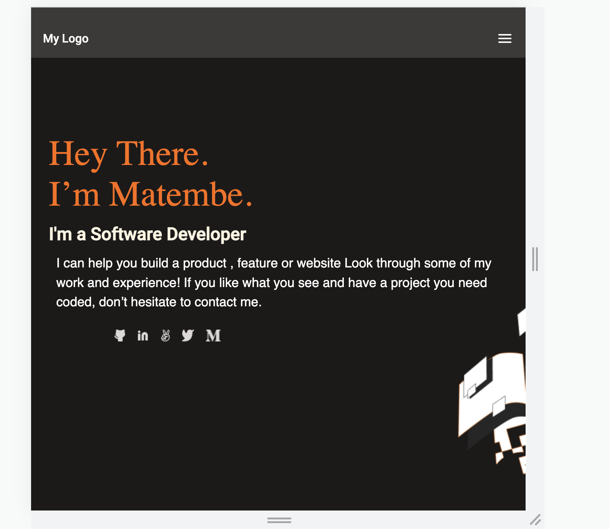

  <h3><b>Portfolio</b></h3>

# 📖 Benjamin_Portfolio
This project is to show case my built projects using the different technologies and skills acquired in the microverse curriculum. Built with HTML CSS and Javascript.

## 🛠 Built With 

  <ul>
    <li><a href="https://www.w3schools.com/html/">HTML</a></li>
    <li><a href="https://www.w3schools.com/css/">CSS</a></li>
    <li><a href="https://www.w3schools.com/javascript/">Javascript</a></li>
  </ul>

## 🚀 Live Demo 

<ul>
    <li><a href="https://benjaminmatembe.github.io/Portfolio/">Live Demo</a></li>
    
  </ul>
  
## 💻 Getting Started 
>To get a local copy up and running, follow these steps.

Clone the code from project using terminal into your local machine and then open with live server on the index.html

>And to get started simply:

 <h1>Setup SSH-key and use this command</h1>
 git clone https://github.com/BenjaminMatembe/Portfolio.git

 <h1>Using HTTPS</h1>

 git clone git@github.com:BenjaminMatembe/Portfolio.git

### Usage

To run the project, execute the following command:

>right click on index.html and open with live server

## 👥 Authors 

👤 **Benjamin Matembe**

- GitHub: [@githubhandle](https://github.com/BenjaminMatembe)
- LinkedIn: [@linkedIn](https://www.linkedin.com/in/matembe-benjamin-b7274122a/)
- Twitter: [@githubhandle](https://twitter.com/Glenmata2)

👤 **Nylbert Victor**

- GitHub: [@redmarverick](https://github.com/redmarverick)
- Twitter: [@MarverickRed]("https://twitter.com/MarverickRed)
- LinkedIn: [LinkedIn](https://www.linkedin.com/in/nylbert-victor-397951120/)

## 🤝 Contributing 

Contributions, issues, and feature requests are welcome on my project!

Feel free to check the [issues page](../../issues/).

## ⭐️ Show your support 

If you like this project you can reuse the code and give a ⭐️ also.

## 🙏 Acknowledgments 

I would like to thank my coding partner for the help rendered when doing this project.

## 📝 License 

This project is [MIT](https://github.com/BenjaminMatembe/Portfolio/blob/main/MIT.md) licensed.
